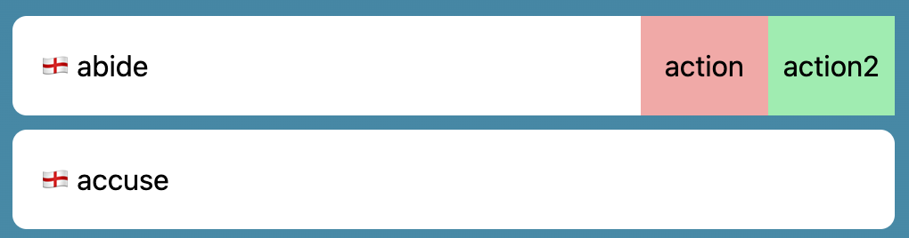

# swiper-action
Simple react component for swipe-to-action.

## ⚠️ Disclaimer
This project is still in its early stages. If you have ideas for improvements, open an issue or a pull request!

## 🚀 Getting started
You can install this package using your favorite package manager:

```npm install swiper-action```

There are two components: 
- `SwiperAction`: acts as the outer container for your content.
- `Action`: used for the definition of your "swipe-to-actions" actions. The handler for each action receives an `InteractionEvent` that can either be a `MouseEvent` or a `TouchEvent`.


```jsx
import { SwiperAction, Action } from "swiper-action";

function Example() {
  const actions = [
    <Action action={(e) => handleClick(e)} key={1}>
      <div className="flex h-full flex-col justify-center">
        action
      </div>
    </Action>,
    <Action action={(e) => handleClick(e)} key={2}>
      <div className="flex h-full flex-col justify-center">
        action2
      </div>
    </Action>,
  ];

  return (
    <SwiperAction actions={actions}>
      <div>Content</div>
    </SwiperAction>
  );
}
```

In the end, this should look something like this image:


### Caveats
1. Currently, the `key` prop needs to be set manually for the `Action` component. This will likely be fixed in the future.
2. The width and height of the outer container for the `SwiperAction` component need to be set explicitly.


## ⚙️ Contributing
This project is just getting started. Hence, feel free to open issues and pull requests!